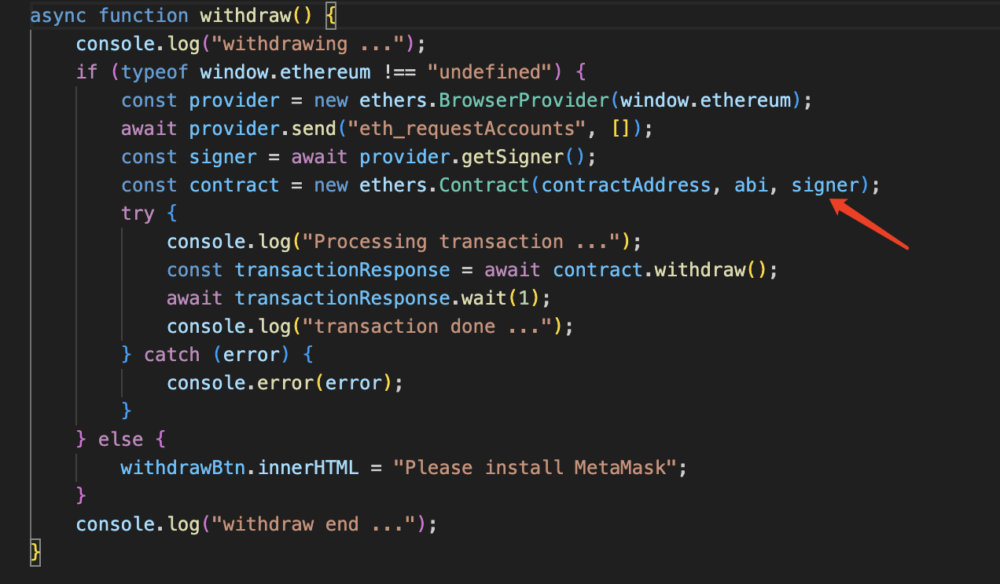
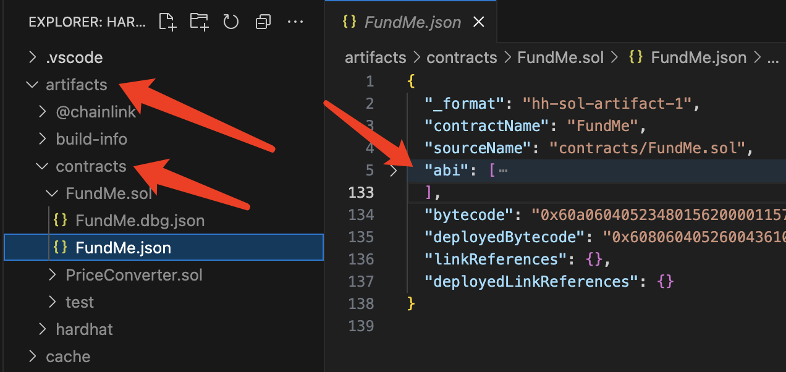
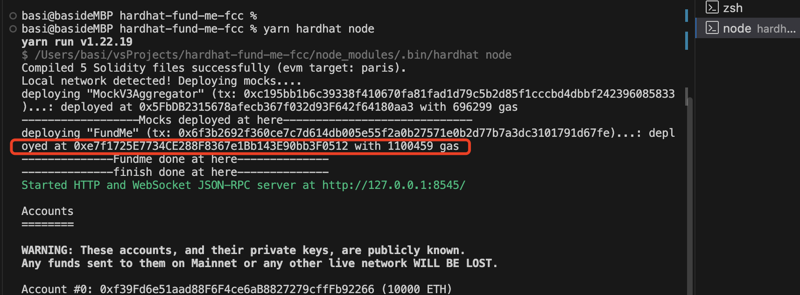

-   #### HTML / Javascript

    Later on, we will use Nextjs / Reactjs to build a static site.

-   #### live Server 插件

    go live -- 快速生成本地页面

-   #### 前后端代码分离

    -   项目启动时，要保证本地 node 是运行中

    -   在前端项目中，通过 constants.js 中的 contractAddress 和 abi，来生成 contract，来调用 contract 中的方法
        

    -   abi 来自后端项目中的 artifacts 下
        

    -   contractAddress 来自本地 node 中
        
